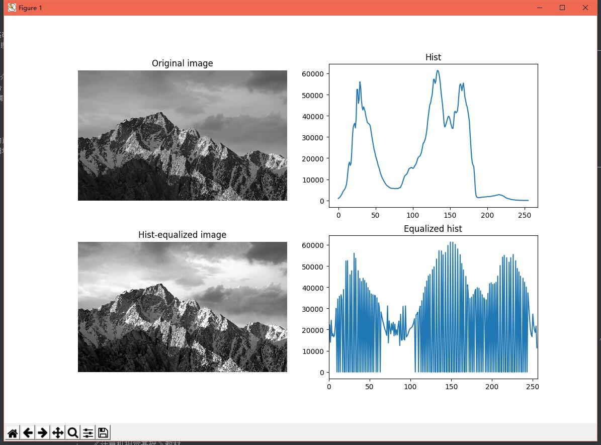

# 《计算机视觉基础》实验报告


# 实验1  图像预处理
> 作者：徐宗迪
>
> 班级：计科1405
>
> 学号：1030414518
>
> 日期：2017-5-11

## 实验内容

- 读取彩色图像并转化为灰度图像
- 求灰度图的直方图
- 执行直方图均衡化

## 开发环境

本实验基于Python 2.7.12实现，用到了以下Python库：

- opencv-python 3.1.0
- numpy 1.12.1
- matplotlib 2.0.2

### OpenCV简介

[OpenCV](http://lib.csdn.net/base/opencv)是由intel的**Gary Bradsky**在1999年发起，第1版在2000年发布。OpenCV是一个开放的计算视觉库，支持大量的计算视觉、[机器学习](http://lib.csdn.net/base/machinelearning)[算法](http://lib.csdn.net/base/datastructure)。 
目前，OpenCV已经支持主流的编程语言如C++，[Python](http://lib.csdn.net/base/python),[Java](http://lib.csdn.net/base/java)等；并且能够夸平台，在Windows/[Linux](http://lib.csdn.net/base/linux)/OS X/[Android](http://lib.csdn.net/base/android)/[iOS](http://lib.csdn.net/base/ios)等主要的[操作系统](http://lib.csdn.net/base/operatingsystem)上均能够使用。并且提供了CUDA和OPENCL的GPU加速接口。 
OpenCV-Python 是OpenCV提供的Python API。它结合了OpenCV C++ API和Python语言两者的优点。

### Numpy简介

NumPy的全名为Numeric Python，是一个开源的Python科学计算库，它包括：

- 一个强大的N维数组对象ndrray；
- 比较成熟的（广播）函数库；
- 用于整合C/C++和Fortran代码的工具包；
- 实用的线性代数、傅里叶变换和随机数生成函数

NumPy的优点：

- 对于同样的数值计算任务，使用NumPy要比直接编写Python代码便捷得多；

- NumPy中的数组的存储效率和输入输出性能均远远优于Python中等价的基本数据结构，且其能够提升的性能是与数组中的元素成比例的；

- NumPy的大部分代码都是用C语言写的，其底层算法在设计时就有着优异的性能，这使得NumPy比纯Python代码高效得多。

### Matplotlib简介
matplotlib是基于numpy的一套Python工具包。这个包提供了丰富的数据绘图工具，主要用于绘制一些统计图形。
其中matplotlib.pyplot是一些命令行风格函数的集合，使matplotlib以类似于MATLAB的方式工作。每个pyplot函数对一幅图片(figure)做一些改动：比如创建新图片，在图片创建一个新的作图区域(plotting area)，在一个作图区域内画直线，给图添加标签(label)等。

## 实验步骤

### 准备工作

```python
import numpy as np
import cv2
import matplotlib.pyplot as plt
```

### 读取图片

```python
origin = cv2.imread(filename, cv2.IMREAD_GRAYSCALE)
```

`cv2.imread()`的第一个参数为图片文件名，第二个参数可取以下值：

	cv2.IMREAD_COLOR : Loads a color image. Any transparency of image will be neglected. It is the default flag.
	cv2.IMREAD_GRAYSCALE : Loads image in grayscale mode
	cv2.IMREAD_UNCHANGED : Loads image as such including alpha channel

本实验需要用到灰度图，故选择`cv2.IMREAD_GRAYSCALE`。

###  求原图像的直方图
图像的灰度直方图是一个1-D的离散函数，可写成
$$
h(f)=n_f(f=0,1,...,L-1)
$$
式中$n_f$是图像$f(x,y)$中具有灰度值的像素个数。

求直方图就是求原图像中各种不同灰度级出现的统计情况。

```python
def my_calcHist_grayscale(src, min, max):
    dst = np.zeros(max - min, np.uint32)
    width, height = src.shape
    for i in range(width):
        for j in range(height):
            dst[src[i, j]] += 1
    return dst

```
```python
hist = my_calcHist_grayscale(origin, 
                             0, # 最小灰度值 
                             256) # 最大灰度值
```

也可使用`opencv`提供的求直方图的函数`calcHist()`，它能提供更为丰富的选项。

```python
hist = cv2.calcHist([origin], 
                    [0], # 使用的通道  
                    None, # 没有使用mask 
                    [256], # HistSize
                    [0, 256]) # 直方图柱的范围
```

### 执行直方图均衡化

图像的灰度累积直方图也是一个1-D的离散函数，可写成
$$
c(f)=\sum^f_{i=0}n_i (f=0,1,...,L-1)
$$
将灰度直方图函数式写成跟一般的概率表达形式，即
$$
p(f)=n_f/n (f=0,1,...,L-1)
$$


直方图均衡化主要用于增强动态范围偏小的图像的反差。直方图均衡化的基本思想是把原始图的直方图变换为均匀分布的形式，进行灰度映射。这里需要确定一个变换函数，也就是增强函数。
$$
g_f=\sum^f_{i=0}\frac{n_i}{n} (f=0,1,...L-1)
$$

```python
def my_equalizeHist_grayscale(src):
    width, height = src.shape
    hist = my_calcHist_grayscale(src, 0, 256)
    cumulate = np.zeros(256, np.uint32)
    for i in range(0, 256):
        for j in range(0, i + 1):
            cumulate[i] += hist[j]

    g = np.zeros(256, np.uint8)
    dst = np.zeros(src.shape, np.uint8)
    for i in range(0, 256):
        g[i] = int(256.0 * cumulate[i] / width / height + 0.5) # g=int[(L-1)c+0.5]

    for i in range(width):
        for j in range(height):
            dst[i, j] = g[src[i, j]]
    return dst
```

```python
equ = my_equalizeHist_grayscale(origin)
```

也可使用`opencv`提供的求直方图的函数`equalizeHist()`，它效率更高。

```python
equ = cv2.equalizeHist(origin)
```

再求出新图像`equ`的直方图，并与原图像对比。

```python
hist_equ = cv2.calcHist([equ], [0], None, [256], [0, 256])
```

### 显示图像

主要是调用`matplotlib`库提供的函数：

```python
# 在同一窗口中显示多幅图像
plt.subplot(221), plt.imshow(origin, 'gray'), plt.axis('off') # 显示灰度图像，关闭坐标轴
plt.subplot(222), plt.plot(hist) # 显示直方图
plt.subplot(223), plt.imshow(equ, 'gray'), plt.axis('off')
plt.subplot(224), plt.plot(hist_equ)
plt.xlim([0, 256]) # 限制x轴取值范围为[0,256]

plt.show()
```


## 实验结果

使用自行实现的函数或`opencv`库中的函数，得到的结果是相同的，但使用` opencv`库函数效率明显提高。



## 实验总结

直方图均衡化是图像预处理中的一项重要且效果明显的工作。
如果一幅图像的灰度级分布均匀，则这种图像有高对比度和多变的灰度色调，显示出一幅灰度级丰富且动态范围大的图像。
通过直方图均衡化，可以将不均衡的直方图变换成均匀分布的直方图，这样就增加了灰度值的动态范围，从而达到增强图像整体对比度的效果。但是，它的具体增强效果不易控制。

## 参考文献

[OpenCV-Python简介](http://46aae4d1e2371e4aa769798941cef698.devproxy.yunshipei.com/lkiller_hust/article/details/52888085)
[numpy简介](http://blog.csdn.net/u014374284/article/details/45420645)
[matplotlib简介](http://www.cnblogs.com/vamei/archive/2012/09/17/2689798.html)
《计算机视觉基础》教材