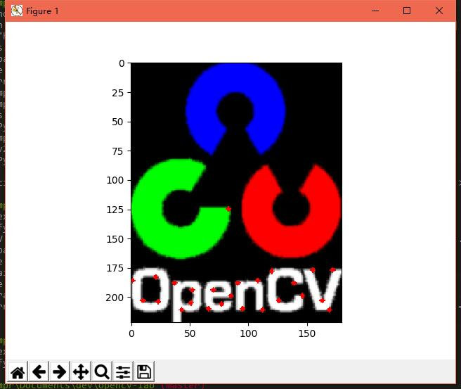

# 《计算机视觉基础》实验报告


# 实验2  特征抽取
> 作者：徐宗迪
>
> 班级：计科1405
>
> 学号：1030414518
>
> 日期：2017-5-18

## 实验背景

**关于图像的特征**

至今为止特征没有万能和精确的定义。特征的精确定义往往由问题或者应用类型决定。特征是一个数字图像中“有趣”的部分，它是许多计算机图像分析算法的起点。因此一个算法是否成功往往由它使用和定义的特征决定。因此特征检测最重要的一个特性是“可重复性”：同一场景的不同图像所提取的特征应该是相同的。

特征检测是图像处理中的一个初级运算，也就是说它是对一个图像进行的第一个运算处理。它检查每个像素来确定该像素是否代表一个特征。假如它是一个更大的算法的一部分，那么这个算法一般只检查图像的特征区域。作为特征检测的一个前提运算，输入图像一般通过高斯模糊核在尺度空间中被平滑。此后通过局部导数运算来计算图像的一个或多个特征。

## 实验内容

- 读取彩色图像并转化为灰度图像
- 执行特征识别
- 显示特征点

## 开发环境

本实验基于Python 2.7.12实现，用到了以下Python库：

- opencv-python 3.1.0

- numpy 1.12.1

- matplotlib 2.0.2

## 实验步骤

### 准备工作

```python
import numpy as np
import cv2
import matplotlib.pyplot as plt
```

读取图片：

```python
origin = cv2.imread(filename, cv2.IMREAD_COLOR)
```

`cv2.imread()`的第一个参数为图片文件名，第二个参数可取以下值：

	cv2.IMREAD_COLOR : Loads a color image. Any transparency of image will be neglected. It is the default flag.
	cv2.IMREAD_GRAYSCALE : Loads image in grayscale mode
	cv2.IMREAD_UNCHANGED : Loads image as such including alpha channel

本实验需要用到彩色图像，故选择`cv2.IMREAD_COLOR`。

### 平滑处理

由于输入的图像锯齿感较为明显，故添加图像平滑作为前提运算。平滑方法为高斯模糊。

```python
origin = cv2.GaussianBlur(origin, (0, 0), 0.8)
```

### 转换为灰度图

```python
gray = cv2.cvtColor(origin, cv2.COLOR_BGR2GRAY)
```


### 特征提取

特征的识别采用`Shi-Tomasi角点检测`算法。

J.Shi和C.Tomasi在1994年在其论文“Good Features to Track”中，提出了一种对Harris角点检测算子的改进[算法](http://lib.csdn.net/base/datastructure)——`Shi-Tomasi`角点检测算子。[OpenCV](http://lib.csdn.net/base/opencv)中函数`goodFeaturesToTrack`就是直接取自他们论文的名字。

```python
corners = cv2.goodFeaturesToTrack(gray, 
	25,  # maxCorners – Maximum number of corners to return
	0.01, # qualityLevel – Parameter characterizing the minimal accepted quality of image corners
	10) # minDistance – Minimum possible Euclidean distance between the returned corners
```

调用该函数，返回提取到的一系列特征点的坐标。

### 显示图像

 将提取到的特征点，作类型转换后叠加在原图像上，以便显示在窗口中。

```python
corners = np.int0(corners) # 浮点型坐标值转换为整型

for i in corners:
    x, y = i.ravel()
    cv2.circle(origin, (x, y), 2, 255, -1) # 根据坐标绘制红色圆点

plt.imshow(origin)
plt.show()
```


## 实验结果



## 实验总结

角点特征检测与匹配是计算机视觉应用中重要的一部分，这需要寻找图像之间的特征建立对应关系。
Shi-Tomasi 算法虽然提出时间较早，但是方法比较充分，很多情况下都能实现良好的效果。

## 参考文献

- 《计算机视觉基础》教材
- J. Shi and C. Tomasi. [Good Features to Track,](http://citeseer.ist.psu.edu/shi94good.html). 9th IEEE Conference on Computer Vision and Pattern Recognition. Springer. 1994.(The Shi and Tomasi corner detector)
- [Shi-Tomasi角点检测](http://blog.csdn.net/dcrmg/article/details/52551637)